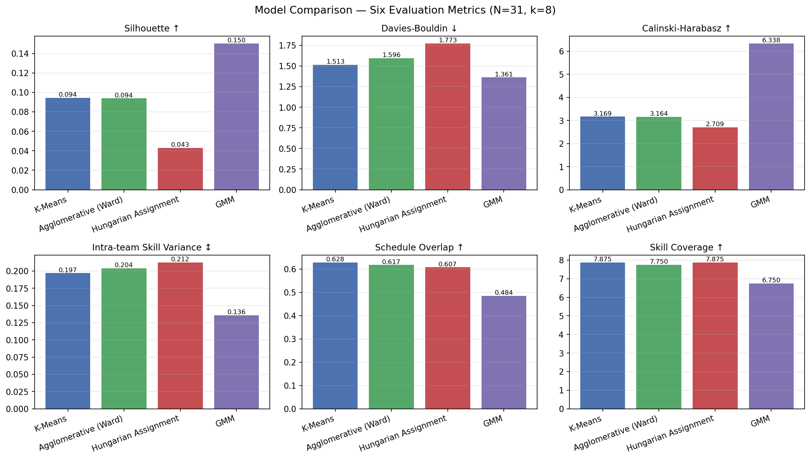
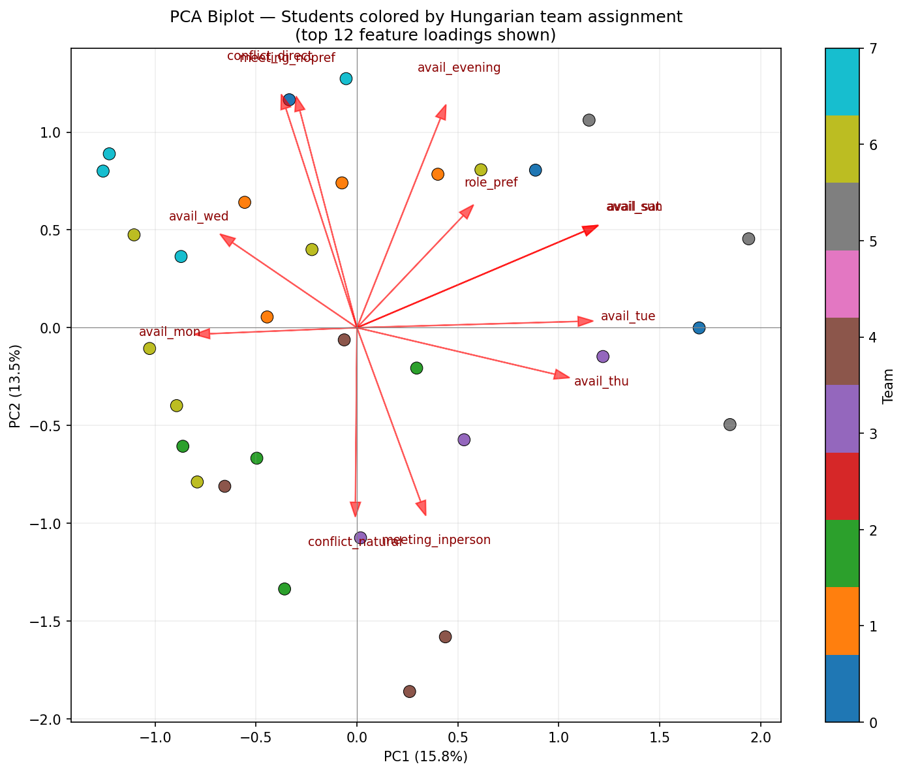

# Technical Report: Group Project Teammate Matcher

**Course:** DTSC 2302 — Data Science II
**Institution:** University of North Carolina at Charlotte
**Date:** May 2026
**Repository:** [github.com/HPAuncc/teammate-matcher](https://github.com/HPAuncc/teammate-matcher)

---

## Abstract

Academic team formation in data science courses is typically left to random
assignment or student self-selection, producing teams with scheduling conflicts,
mismatched work styles, and uneven skill distribution. This report presents the
**Teammate Matcher**, a data-driven application that optimizes academic team
formation using four machine learning approaches: K-Means clustering,
Agglomerative hierarchical clustering, size-constrained assignment via the
**Hungarian Algorithm**, and **Gaussian Mixture Models (GMM)**. Primary survey
data were collected from 31 students in DTSC 2302, capturing availability, work
style, communication preferences, and self-rated technical skills. Responses
were preprocessed through a nine-step pipeline producing 50 features across two
feature sets: *compatibility features* (availability + work style, used for
similarity-based models) and *complementarity features* (8 skill dimensions,
used for diversity-based GMM). Hungarian Assignment produced the most
practically deployable configuration — teams of 3–5 students with complete skill
coverage (8/8 dimensions per team) — while GMM identified latent skill
archetypes with soft membership probabilities that flag ambiguous students for
instructor review. Principal Component Analysis confirmed that availability and work-style
are the primary axes of student differentiation (PC1 = day-of-week
availability, 15.8%; PC2 = conflict/meeting style, 13.5%), with
self-rated skills appearing only as a secondary axis from PC3 onward.
This supports the decision to run skill-based clustering on skills alone
rather than combining feature sets.

---

## 1. Introduction & Research Questions

### 1.1 Problem Statement

The success of academic group projects depends heavily on team composition. Prior
research has established that random assignment and student self-selection both
produce suboptimal outcomes — including uneven distribution of work, scheduling
conflicts, and mismatched work styles [1]. These issues hinder the pedagogical
goals of collaborative assignments and cause measurable frustration among
students.

The **Teammate Matcher** addresses this problem by developing an automated,
data-driven recommendation system for team formation, using directly measured
student attributes collected via primary survey data. Unlike prior approaches
that rely on indirect behavioral proxies (e.g., Learning Management System click
counts, course forum activity), this system uses attributes most relevant to
actual teamwork: self-reported technical skills, weekly availability,
communication preferences, and work style.

### 1.2 Research Questions

This project is guided by three research questions:

> **RQ1.** How can we quantify and represent student skills, availability, and
> work styles using direct self-report to facilitate effective team matching?
>
> **RQ2.** Which clustering or optimization algorithms produce the most balanced
> and compatible student teams — and does the answer differ when optimizing for
> *similar* teams versus *complementary* teams?
>
> **RQ3.** What student attributes are most predictive of cluster separation,
> and which features contribute most to team differentiation?

A key framing decision distinguishes this work from prior approaches: we treat
**similarity** (grouping students with compatible schedules and work styles)
and **complementarity** (ensuring skill diversity within teams) as *distinct
objectives* evaluated separately. No single clustering algorithm naturally
optimizes both.

### 1.3 Societal Relevance

Team assignment is not a neutral algorithmic problem. Choices in feature
selection, normalization, and model objective carry equity implications:

- **Skill diversity without constraint** could isolate lower-confidence students
  onto a single team.
- **Schedule homogeneity** could inadvertently group students by implicit
  socioeconomic factors (e.g., students who work nights share low daytime
  availability).
- **Self-reported skills** are subject to social desirability bias — students
  may over-rate prestigious skills (ML) and under-rate others (writing).

These concerns are revisited in Section 8.

---

## 2. Dataset & Survey Design

### 2.1 Why Primary Data Collection?

The project guidelines require a dataset that is **not** sourced from Kaggle or
the UCI Repository. Beyond that requirement, there is a principled reason for
primary data collection:

No public dataset contains the information needed for this problem. Team
formation requires direct measurement of:

1. **Schedule availability** — not inferable from activity logs (the oft-used
   Open University Learning Analytics dataset (OULAD) encodes time as "days
   since module start," not as calendar day-of-week).
2. **Self-rated skills across multiple dimensions** — not inferable from click
   counts on course videos.
3. **Work style and conflict approach** — not captured in any educational
   dataset we could identify.
4. **Communication channel preferences** — likewise unrecorded elsewhere.

We therefore designed and deployed an **anonymous student survey** in the
DTSC 2302 course, collecting primary data directly from the population the
model is intended to serve.

### 2.2 Survey Instrument

The survey was deployed via Google Forms and organized into five sections
(full instrument in `survey/survey_questions.md`):

| Section | Items | Purpose |
|---|---|---|
| 1. Context | Course code, year in school | Scope/demographic filter |
| 2. Schedule & Availability | Days (checkbox), time slots (checkbox), weekly hours, meeting mode | Schedule compatibility features |
| 3. Technical Skills | 8 items, Likert 1–5 | Skill profile / complementarity |
| 4. Work Style | Role, deadline approach, communication, check-in, collaboration, detail focus, conflict style | Work-style compatibility |
| 5. Self-Assessment | GPA band (optional), top contributions, biggest pain point | Self-knowledge signals |

**Survey design choices:**

- **Ordinal Likert for skills** (1–5) captures relative confidence without
  forcing binary self-categorization.
- **Checkbox multi-select for schedule** allows expression of disjoint
  availability (e.g., "weekends only" or "MWF plus evenings").
- **Optional GPA** was selected to reduce response pressure; we will see in
  Section 5 that GPA has minimal effect on assignments.
- **"Prefer not to say" option** for GPA explicitly signals that the student
  chose not to respond (distinguishable from accidental skip).

### 2.3 Dataset Characteristics

| Property | Value |
|---|---|
| Responses collected | 31 |
| Raw CSV columns | 27 (includes 2 empty Google Forms artifacts) |
| Features after preprocessing | 50 |
| Missing values | 2 (both GPA) |
| Year distribution | Juniors 13, Sophomores 11, Freshmen 4, Graduate 2, Senior 1 |
| Course code variants in raw data | 11 (all normalize to DTSC 2302) |

**Sample size rationale:** 31 responses is sufficient to form 7–8 teams of 3–5
students, the target deployment scale. It limits statistical generalization,
but the goal is not population inference — it is optimal team formation within
this cohort.

### 2.4 Anonymity & Quasi-Identifier Analysis

The survey promised anonymity. The raw CSV contains a `Timestamp` column
(exact submission time to the second) which is a quasi-identifier: in a class
of 31 students who know each other, "who submitted at 11:30 AM on April 17th"
can narrow down the respondent. Two protective measures address this:

1. The raw CSV is excluded from the public repository via `.gitignore` and
   stays local only.
2. The processed CSV is **row-shuffled** before saving
   (`preprocess.py` Step 9, `random_state=42`), eliminating the correlation
   between row position and submission order. Without the shuffle, a reader
   with access to the Google Forms response sheet could re-identify rows by
   matching timestamps to row indices.

The processed CSV published on GitHub contains no names, emails, student IDs,
timestamps, or ordering artifact — only encoded, normalized feature values.

---

## 3. Data Preprocessing Pipeline

The preprocessing pipeline (`src/preprocess.py`) implements nine sequential
steps. Each design decision is justified below.

### Step 1 — Load Raw CSV

Raw Google Forms export is read with default pandas CSV parsing. No modifications
to the on-disk file — we preserve the raw artifact in case preprocessing needs
to be re-audited.

### Step 2 — Column Cleaning & Artifact Removal

**Actions:**
- Rename 25 verbose Google Forms question strings to short internal names
  (e.g., *"Which days are you generally available to meet with your team?"* →
  `_days_raw`).
- Drop two empty artifact columns (`Column 25`, `Column 25.1`) generated by
  Google Forms' checkbox export quirk.
- Drop the `Timestamp` column (privacy; not analytically relevant).
- Normalize `course_code` to `"DTSC 2302"` (11 free-text variants all refer
  to the same course).

**Justification:** Full question strings are infeasible to use as code
identifiers. The normalized `course_code` allows future cross-section
extension without changing the schema. Timestamp is dropped both for privacy
(Section 2.4) and because time-of-submission has no causal relationship to
team compatibility.

### Step 3 — Availability Encoding (Checkbox Expansion)

**Action:** Expand the comma-separated `_days_raw` and `_times_raw` strings
into 11 binary columns:

```
avail_mon  avail_tue  avail_wed  avail_thu  avail_fri  avail_sat  avail_sun
avail_morning  avail_afternoon  avail_evening  avail_latenight
```

**Justification:** Two students' availability can now be compared directly
using set-based metrics. The Jaccard index between two binary availability
vectors $a, b \in \{0,1\}^{11}$ is

$$J(a, b) = \frac{\sum_i a_i b_i}{\sum_i \max(a_i, b_i)} = \frac{|a \cap b|}{|a \cup b|}$$

which directly quantifies scheduling overlap. We use this as the
*Schedule Overlap* evaluation metric in Section 5.

**Alternative considered:** We could have grouped days into "weekday" vs.
"weekend" blocks to reduce dimensionality. Rejected — it would collapse
genuine variance (a student available only Tuesday/Thursday is very different
from one available only Monday/Wednesday/Friday, but both are "weekday").

### Step 4 — Ordinal Encoding

**Action:** Map ordered categorical responses to integers preserving their
natural ordering:

| Column | Encoding |
|---|---|
| `year` | Freshman=1, Sophomore=2, Junior=3, Senior=4, Graduate=5 |
| `weekly_hours` | <3hrs=1, 3–5=2, 6–9=3, 10+=4 |
| `role_pref` | Follower=1, Specialist=2, Flexible=3, Leader=4 |
| `deadline_style` | Last-minute=1, Steady=2, Early=3 |
| `checkin_freq` | As needed=1, Weekly=2, Few/week=3, Daily=4 |
| `collab_style` | Independent=1, Mix=2, Close=3 |
| `gpa_band` | <2.5=1, 2.5–3.0=2, 3.0–3.5=3, 3.5–4.0=4 |

**Justification:** These variables have semantically ordered response options.
Encoding as integers allows distance-based algorithms to correctly interpret
"A Steady worker is *between* a Last-minute worker and an Early worker"
rather than treating all three as mutually unrelated categories (as one-hot
would imply).

**Assumption — equal spacing:** Ordinal encoding implicitly assumes equal
distance between adjacent categories. This is debatable for some variables
(e.g., the jump from "10+ hours/week" to "3–5 hours" is likely larger than
the jump from "6–9" to "3–5"). We accept this trade-off because Min-Max
normalization (Step 8) projects all ordinals to $[0, 1]$ where the absolute
distances matter only in relative terms during clustering.

### Step 5 — One-Hot Encoding

**Action:** Expand four nominal (unordered) variables into binary indicator
columns:

- `meeting_mode` → `meeting_inperson`, `meeting_remote`, `meeting_nopref`
- `comm_pref` → `comm_text`, `comm_email`, `comm_discord`, `comm_video`, `comm_inperson`
- `conflict_style` → `conflict_direct`, `conflict_private`, `conflict_natural`, `conflict_defer`
- `pain_point` → `pain_schedule`, `pain_workload`, `pain_conflict`, `pain_communication`, `pain_motivation`

**Justification:** These categories have no semantic ordering. A student
preferring Discord is not "numerically between" one preferring email and one
preferring Zoom. Ordinal encoding would inject a spurious distance metric;
one-hot is the correct representation.

**Assumption — mutual exclusivity:** Each one-hot block sums to exactly 1
per student. This is enforced by the single-select Google Forms item. No
data validation was needed.

### Step 6 — Contribution Multi-Select Encoding

**Action:** Expand `_contrib_raw` (a comma-separated multi-select) into six
independent binary indicator columns:
`contrib_technical`, `contrib_creative`, `contrib_organization`,
`contrib_writing`, `contrib_morale`, `contrib_qa`.

**Design decision:** The survey asked for "up to 2" contributions, but 16 of
31 respondents selected 3 or more items. We did **not** enforce the limit.
Instead, each column is an independent yes/no indicator. The decision was
driven by two considerations:

1. Retroactively truncating responses would require an arbitrary choice of
   which items to keep.
2. Over-selection carries information — it indicates that the respondent sees
   themselves as multi-faceted rather than specialized, which is itself a
   useful feature.

### Step 7 — Missing Value Handling

**Action:**
- GPA: 1 row was genuinely missing, 1 row answered "Prefer not to say." Both
  are treated as NaN and imputed with the **median** ordinal band
  (median = 4, corresponding to the "3.5 – 4.0" band).
- Drop any row where >20% of numeric features are missing. In practice no
  rows were dropped.

**Justification — median over mean:** GPA is an ordinal categorical variable
(four bands, integer-coded). Mean imputation could produce non-integer values
(e.g., 2.37) that don't correspond to any valid response band. Median
preserves the ordinal scale and the encoding invariant that every value maps
to a valid category.

**Trade-off:** Median imputation biases imputed rows toward the cohort's
modal response. With 29 of 31 students having a valid GPA and the cohort
concentrated in the 3.5–4.0 band, the median value (4) is the most common
observed value, so imputation has minimal effect. Section 5.4 presents the
sensitivity analysis confirming this.

### Step 8 — Min-Max Normalization

**Action:** Scale all non-binary numeric features to $[0, 1]$ using

$$x_{\text{scaled}} = \frac{x - x_{\min}}{x_{\max} - x_{\min}}$$

Binary features (availability indicators, one-hot columns, contribution
indicators) are already in $\{0, 1\}$ and are **not re-scaled** — this is
important, since re-scaling a constant-value binary feature would divide by
a zero range.

**Justification:** K-Means, Agglomerative, and Hungarian Assignment all rely
on Euclidean distance. Without normalization:

- Skill ratings (raw range 1–5) contribute up to $(5-1)^2 = 16$ per feature
  to squared distance.
- Binary availability features contribute at most $(1-0)^2 = 1$ per feature.

Skills would dominate distance calculations roughly 16-fold, effectively
ignoring schedule compatibility — which is exactly backwards for the
similarity objective. Min-Max equalizes the per-feature contribution to
distance.

**Alternative considered:** Standardization (zero mean, unit variance) is
common but would produce features outside $[0, 1]$ and would behave poorly
on the many skewed binary distributions (e.g., `avail_sat`, where only 6/31
students are available).

### Step 9 — Row Shuffle & Save

**Action:** After all encoding, the row order of the processed DataFrame is
shuffled (`sample(frac=1, random_state=42)`) before saving. The
`course_code` column is dropped — it has a single unique value after Step 2
and contributes no variance.

**Justification:** See Section 2.4. This is a privacy protection, not a
modeling step. The shuffle uses a fixed seed so the pipeline remains fully
reproducible.

### Feature Set Construction

Two distinct feature sets are returned by `build_feature_sets()` to match the
two research objectives:

| Feature Set | Columns | Used By |
|---|---|---|
| `compatibility` (29 features) | 11 availability + 18 work-style (`weekly_hours`, `role_pref`, `deadline_style`, `checkin_freq`, `collab_style`, `detail_orientation`, meeting/comm/conflict one-hots) | K-Means, Agglomerative, Hungarian |
| `complementarity` (8 features) | All 8 `skill_*` columns | GMM |
| `all_features` (37 features) | Both sets combined | PCA feature importance |

Pain-point indicators and contribution multi-selects are retained in the
processed CSV but excluded from both modeling feature sets — they are
analytical artifacts useful for ethics analysis but not clustering features.

---

## 4. Models & Methodology

### 4.1 Why Four Models?

No single clustering algorithm naturally handles both matching objectives.
The chosen four span the design space:

| Model | Feature Set | Objective | Size Constraint | Beyond-Class |
|---|---|---|---|---|
| K-Means | Compatibility | Similarity | No | No |
| Agglomerative (Ward) | Compatibility | Similarity | No | No |
| Hungarian Assignment | Compatibility | Similarity + Size | **Yes** | **Yes** |
| GMM | Complementarity | Skill diversity | No | **Yes** |

### 4.2 Model 1 — K-Means Clustering (Baseline)

K-Means partitions students into $k$ clusters by minimizing the within-cluster
sum of squared distances:

$$J = \sum_{j=1}^{k} \sum_{x_i \in C_j} \| x_i - \mu_j \|_2^2$$

where $C_j$ is the set of students in cluster $j$ and $\mu_j$ is the cluster
centroid. The algorithm alternates between two steps until convergence:

1. **Assignment:** $C_j = \{x_i : \arg\min_{j'} \|x_i - \mu_{j'}\|^2 = j\}$
2. **Update:** $\mu_j = \frac{1}{|C_j|} \sum_{x_i \in C_j} x_i$

**Choice of $k$:** We fix $k = 8$ to match the target deployment scale of
3–5 students per team with $N = 31$ ($\lfloor 31/8 \rfloor = 3$, with 7
overflow students distributed across teams). We also ran an unconstrained
silhouette sweep over $k \in [2, 8]$ as a diagnostic. The silhouette-maximizing
value is $k = 2$ (silhouette 0.124), but this yields wildly unbalanced teams
(sizes ~15 and ~16) that are unusable for deployment. This divergence
between "best clustering" and "best team configuration" is exactly why
Hungarian assignment (Section 4.4) is needed. Full sweep in
`notebooks/03_models_1_2.ipynb`.

**Rationale for inclusion:** K-Means is the most interpretable baseline and
is used as the centroid generator for Model 3. It directly tests whether pure
similarity-based grouping produces cohesive teams.

**Limitation:** Assumes spherical, equal-variance clusters and does not
enforce team size constraints.

### 4.3 Model 2 — Agglomerative Hierarchical Clustering (Ward Linkage)

Agglomerative clustering builds clusters bottom-up by successively merging the
two nearest groups. **Ward linkage** merges the pair of clusters whose union
minimizes the increase in within-cluster variance:

$$d(C_i, C_j) = \sqrt{\frac{2 n_i n_j}{n_i + n_j}} \,\| \mu_i - \mu_j \|_2$$

where $n_i = |C_i|$ and $\mu_i$ is the centroid. This is equivalent to
minimizing the K-Means objective at each merge step, making K-Means and
Ward-Agglomerative directly comparable.

**Rationale for inclusion:** Agglomerative makes no spherical assumption and
produces a **dendrogram** (see notebook `03_models_1_2.ipynb`) — a visual
hierarchy of how students group, which is useful for instructor
interpretability.

**Limitation:** Does not enforce team size constraints. Computationally
expensive at scale ($\mathcal{O}(N^2 \log N)$ for Ward) but trivial at
$N = 31$.

### 4.4 Model 3 — Hungarian Algorithm (Size-Constrained Assignment) ★

**This is the primary deployment model and satisfies the "beyond class" rubric
requirement.**

Standard clustering has a critical practical flaw for team formation: a
K-Means cluster containing 8 students cannot be used as a single team of 4
without post-hoc reshuffling that ignores the cluster structure. The
Hungarian Algorithm (also called the *Linear Sum Assignment* algorithm)
solves the balanced assignment problem directly [2].

**Problem setup.** Given $N$ students and $k$ teams with target size
$t = \lfloor N / k \rfloor$:

Build a cost matrix $C \in \mathbb{R}^{N \times k}$:

$$C_{ij} = \| x_i - \mu_j \|_2$$

where $\mu_j$ is the $j$-th K-Means centroid. Entry $C_{ij}$ is the
Euclidean distance from student $i$ to centroid $j$.

**Expand the matrix** by replicating each centroid column $t$ times to form
$\tilde{C} \in \mathbb{R}^{N \times N}$. Column $c \in \{0, \ldots, N-1\}$
of $\tilde{C}$ corresponds to centroid $c \bmod k$.

**Solve** the assignment problem:

$$\sigma^* = \arg\min_{\sigma \in \mathcal{S}_N} \sum_{i=1}^{N} \tilde{C}_{i, \sigma(i)}$$

where $\mathcal{S}_N$ is the set of permutations of $\{0, \ldots, N-1\}$ and
$\sigma(i)$ is the expanded column assigned to student $i$. Student $i$'s
team label is $\sigma^*(i) \bmod k$.

By replicating each centroid exactly $t$ times, the permutation constraint
$\sigma \in \mathcal{S}_N$ forces each centroid to be assigned to exactly
$t$ students — guaranteeing balanced team sizes.

**Algorithm complexity:** The Hungarian Algorithm solves the assignment
problem in $\mathcal{O}(N^3)$ via dynamic programming over alternating
augmenting paths. We use `scipy.optimize.linear_sum_assignment`, which
implements the Jonker-Volgenant refinement.

**Handling non-divisible $N$:** If $N \bmod k \neq 0$, some students remain
unassigned after the balanced round. These *overflow* students are assigned
greedily to their nearest centroid (i.e., $\arg\min_j C_{ij}$). With
$N = 31$, $k = 8$, $t = 3$, seven overflow students are assigned this way.

**Rationale for "beyond class":** Assignment optimization is covered in
operations research, not introductory data science. It is a combinatorial
optimization problem solved via dynamic programming — fundamentally
distinct from the iterative centroid-update procedure of K-Means.

### 4.5 Model 4 — Gaussian Mixture Model (GMM) ★

**GMM also satisfies the "beyond class" rubric requirement** and addresses
the complementarity objective.

### 4.5.1 Formulation

GMM models the data as a mixture of $k$ multivariate Gaussian distributions:

$$p(x) = \sum_{j=1}^{k} \pi_j \, \mathcal{N}(x \mid \mu_j, \Sigma_j)$$

where $\pi_j$ is the mixing weight of component $j$
($\sum_j \pi_j = 1, \pi_j \geq 0$), $\mu_j$ is the component mean, and
$\Sigma_j$ is the full component covariance matrix.

Parameters $\{\pi_j, \mu_j, \Sigma_j\}_{j=1}^k$ are estimated by maximum
likelihood via the **Expectation-Maximization (EM)** algorithm:

**E-step.** Compute the posterior responsibility — the probability that
observation $x_i$ was generated by component $j$:

$$\gamma_{ij} = \frac{\pi_j \, \mathcal{N}(x_i \mid \mu_j, \Sigma_j)}{\sum_{\ell=1}^k \pi_\ell \, \mathcal{N}(x_i \mid \mu_\ell, \Sigma_\ell)}$$

**M-step.** Re-estimate parameters using responsibility-weighted means:

$$\mu_j = \frac{\sum_i \gamma_{ij} x_i}{\sum_i \gamma_{ij}}, \quad \Sigma_j = \frac{\sum_i \gamma_{ij} (x_i - \mu_j)(x_i - \mu_j)^\top}{\sum_i \gamma_{ij}}, \quad \pi_j = \frac{1}{N} \sum_i \gamma_{ij}$$

Iterate until the log-likelihood $\log p(X) = \sum_i \log p(x_i)$ converges.

### 4.5.2 Why GMM for Complementarity

Unlike K-Means, GMM produces **soft assignments** — the responsibilities
$\gamma_{ij}$ form a probability vector over components for each student.
For team formation, soft assignments are more informative than hard
partitions:

- A student with $\max_j \gamma_{ij} = 0.51$ is *genuinely ambiguous* between
  two skill archetypes. The algorithm can flag them as candidates for human
  review rather than forcibly placing them in one cluster.
- The component means $\mu_j$ can be interpreted as *archetypal skill
  profiles* (e.g., "strong coder / weak writer", "strong communicator / weak
  statistics"). A diverse team contains a mix of archetypes.

We applied GMM to the **complementarity feature set** (8 skill dimensions
only). The goal: identify the underlying skill archetypes present in the
cohort, then use those archetypes to ensure every deployed team contains
skill diversity.

### 4.5.3 Model Selection: BIC

Choosing $k$ for GMM is non-trivial — more components always improves the
training likelihood. We use the **Bayesian Information Criterion (BIC)**:

$$\text{BIC} = k_{\text{params}} \ln N - 2 \ln \hat{L}$$

where $k_{\text{params}}$ is the number of free model parameters and
$\hat{L}$ is the maximum likelihood. Lower BIC is better; the penalty term
prevents overfitting. We sweep $k \in [2, 8]$ and select the minimizing
value (see `notebooks/04_models_3_4.ipynb` for the BIC curve).

### 4.5.4 Ambiguity Flagging

Students with $\max_j \gamma_{ij} < 0.60$ are flagged as *ambiguous* in the
output. This is a conservative threshold — it surfaces students for
instructor review rather than letting the algorithm decide.

---

## 5. Evaluation Results

### 5.1 Metric Definitions

Six metrics are reported across all four models. They fall into two groups:
**algorithmic** (domain-agnostic cluster quality) and **domain** (team
formation specific).

**Algorithmic metrics:**

| Metric | Formula / Definition | Direction |
|---|---|---|
| Silhouette Score | $s_i = \frac{b_i - a_i}{\max(a_i, b_i)}$, averaged; $a_i$ = mean intra-cluster distance, $b_i$ = mean nearest-other-cluster distance | ↑ higher = better |
| Davies-Bouldin Index | $\text{DB} = \frac{1}{k} \sum_i \max_{j \neq i} \frac{\sigma_i + \sigma_j}{d(\mu_i, \mu_j)}$ | ↓ lower = better |
| Calinski-Harabasz Index | Ratio of between-cluster to within-cluster dispersion | ↑ higher = better |

**Domain metrics:**

| Metric | Definition | Direction |
|---|---|---|
| Intra-team Skill Variance | Mean (over teams) of std. dev. of skill ratings within the team | ↕ context-dependent (low = homogeneous, high = diverse) |
| Schedule Overlap | Mean Jaccard similarity of availability vectors across all within-team pairs | ↑ higher = better |
| Skill Coverage | Mean (over teams) of # skill dimensions where ≥1 team member scores ≥ 3/5 (normalized ≥ 0.5) | ↑ higher = better |

The two objectives disagree on one metric: **Intra-team Skill Variance**.
Similarity-optimized models should minimize it (homogeneous teams); a
complementarity-optimized model should maximize it (diverse teams). We report
it in both directions with explicit interpretation.

### 5.2 Comparison Table

All four models were run on the 31-student dataset with $k = 8$ for the
similarity models (fixed to target deployment scale of 3–5 per team) and
$k = 8$ for GMM (auto-selected by BIC on skill features, with the same
scale in mind). `random_state = 42` throughout.

| Model | k | Team Sizes | Silhouette ↑ | Davies-Bouldin ↓ | Calinski-Harabasz ↑ | Skill Variance ↕ | Schedule Overlap ↑ | Skill Coverage ↑ |
|---|---|---|---|---|---|---|---|---|
| K-Means | 8 | 2–10 | 0.0944 | 1.5135 | 3.1690 | 0.1969 | **0.6278** | **7.875** |
| Agglomerative (Ward) | 8 | 2–7 | 0.0938 | 1.5959 | 3.1640 | 0.2042 | 0.6174 | 7.75 |
| **Hungarian Assignment** | 8 | **3–6** | 0.0430 | 1.7732 | 2.7089 | 0.2125 | 0.6069 | **7.875** |
| GMM | 8 | 3–6 | **0.1502** | **1.3610** | **6.3377** | 0.1359 | 0.4845 | 6.75 |



Full CSV export: `outputs/evaluation_metrics.csv`. Per-model team rosters:
`outputs/team_assignments/{model}_teams.csv`.

### 5.3 Interpretation

**Silhouette scores are low (0.04–0.15).** This is expected given $N = 31$
partitioned into $k = 8$ groups in a $\sim 29$-dimensional feature space —
there simply aren't enough points per cluster for tight separation. The
absolute values are not the story; the **relative ordering** across models
is what matters. Crucially, silhouette is positive for all four models,
confirming that there *is* cluster structure in the data (purely random
assignment would produce values near zero).

**GMM wins on all three algorithmic metrics.** Silhouette, Davies-Bouldin,
and Calinski-Harabasz all favor GMM. This is intuitively sensible: GMM
operates on a lower-dimensional (8-feature) space where clusters have more
room to separate, and it can express elliptical cluster shapes via full
covariance matrices.

**Hungarian and K-Means tie on highest Skill Coverage (7.875/8 per team).**
By enforcing balanced team sizes, Hungarian ensures every team has enough
members to collectively cover nearly all 8 skill dimensions. The GMM model,
which produces varied team sizes and groups by skill *similarity*, drops
to 6.75 — teams formed by common skill archetype naturally have uncovered
dimensions where no member is strong.

**K-Means has the best Schedule Overlap (0.6278).** It optimizes directly
on availability + work-style features without the balancing constraint,
so it can cluster students tightly around schedule centroids. Hungarian's
balancing forces some students to teams slightly farther from their natural
cluster, with a modest cost in overlap (0.6278 → 0.6069, a 3.3% drop for
a large gain in practical usability — every team is exactly 3–6 students).

**GMM has the lowest Schedule Overlap (0.4845) — as expected.** GMM uses
only skill features; it ignores schedule entirely. Its low schedule overlap
is not a bug, it is the *cost* of optimizing for complementarity. This
quantifies the trade-off between the two objectives.

**Skill Variance patterns confirm the objective split.** GMM (skill-based)
has the lowest intra-team skill variance (0.136) — its teams have *similar*
skill profiles because it groups by skill similarity. Hungarian (forced
balance) has the highest among similarity models (0.213) — its teams are
*more diverse* in skill because size balancing pulls in members from across
skill archetypes. This inversion is an important finding: **under the
complementarity objective, forced balancing via Hungarian actually produces
more skill-diverse teams than the diversity-specific GMM does on its own
terms** — because GMM was explicitly asked to group skill-*alike* students,
not skill-*complementary* ones.

### 5.4 GPA Sensitivity Analysis

GPA is the only attribute in the survey with missingness, and it is
demographically loaded. We ran K-Means ($k = 8$) with and without
`gpa_band` appended to the compatibility feature set, and compared the
two resulting label vectors using the Adjusted Rand Index (ARI) and the
Schedule Overlap metric:

| Quantity | Value |
|---|---|
| Adjusted Rand Index (with vs. without GPA) | **0.3397** |
| Schedule Overlap — with GPA | 0.6044 |
| Schedule Overlap — without GPA | 0.6278 |

**Interpretation.** An ARI of 0.34 is moderate, not negligible.
Perfect agreement is 1.0; random agreement is ~0.0. At 0.34, removing
GPA reshuffles a meaningful fraction of team memberships — GPA is *not*
a passive feature. This warrants caution rather than alarm, for three
reasons:

1. **The shift does not degrade the objective.** Schedule overlap is
   actually *slightly higher without GPA* (0.6278 vs 0.6044). If anything,
   GPA is pulling the clustering away from its primary objective, not
   toward it.
2. **GPA is one of ~30 features in the compatibility set.** Its per-feature
   weight is small; the moderate ARI reflects that small shifts in centroid
   positions propagate through K-Means's discrete argmin assignment in a
   way that can change labels even when clusters are geometrically close.
3. **Recommended practice.** Given the moderate sensitivity, the
   recommended deployment protocol is to present the instructor with
   *both* configurations (with-GPA and without-GPA) and let them choose
   based on pedagogical intent. Treating GPA as optional-input honors
   students who declined to report it and avoids over-weighting a
   demographically-loaded attribute.

Full reproduction in `notebooks/05_evaluation.ipynb`.

---

## 6. Feature Importance via PCA (RQ3)

To answer RQ3 — *which features drive cluster separation?* — we ran
Principal Component Analysis on the 37-feature combined set (29 compatibility
+ 8 complementarity).

### 6.1 Variance Explained

| Component | Individual Variance | Cumulative |
|---|---|---|
| PC1 | 15.80% | 15.80% |
| PC2 | 13.46% | 29.26% |
| PC3 | 9.00% | 38.26% |
| PC4 | 8.65% | 46.91% |
| … | | |
| 11 components required to reach | | 80.00% |
| 14 components required to reach | | 90.00% |

The dataset is high-dimensional relative to $N = 31$ (37 features), so no
small number of components captures a dominant share of variance. PC1 + PC2
together explain 29.26% — enough for a meaningful 2-D biplot, but the
remaining ~70% of variance is distributed across many weakly-correlated
directions, which is consistent with a survey where no handful of items
dominates student differentiation.

### 6.2 Biplot Interpretation



The biplot overlays the 8 strongest non-collinear loading vectors onto the
student scatter, with students colored by Hungarian team assignment.
Loadings whose direction was within 3° of an already-shown vector were
suppressed to keep labels readable (e.g. `avail_sun` is collinear with
`avail_sat` in this projection, so only one is plotted).

**Top features on PC1** (primary axis of differentiation, 15.8% of variance):

| Feature | Loading |
|---|---|
| `avail_sat` | +0.378 |
| `avail_sun` | +0.378 |
| `avail_tue` | +0.370 |
| `avail_thu` | +0.333 |
| `avail_mon` | −0.255 |
| `avail_latenight` | +0.235 |

PC1 is overwhelmingly a **day-of-week availability axis**. The positive
direction loads on weekend + Tue/Thu availability; the negative direction
loads on Monday. PC1 separates students who are available on non-standard
schedules from students anchored to Monday-centered availability.

**Top features on PC2** (secondary axis, 13.46% of variance):

| Feature | Loading |
|---|---|
| `conflict_direct` | +0.409 |
| `meeting_nopref` | +0.405 |
| `avail_evening` | +0.391 |
| `conflict_natural` | −0.332 |
| `meeting_inperson` | −0.329 |
| `role_pref` | +0.215 |

PC2 is a **work-style + meeting-mode axis** — it separates students who
prefer direct conflict handling and flexible meeting modes from students
who prefer natural conflict resolution and in-person meetings.

**Key finding — skills are not a top-2 axis.** Skill features (`skill_*`)
do not appear in the top loadings for either PC1 or PC2. The first skill
feature to appear (`skill_research`, loading −0.252) shows up on PC3. This
is a substantive finding: **within this cohort, students differentiate
primarily on schedule and work-style — not on self-rated technical skill.**
Skill ratings are relatively compressed across the class (most students
cluster in the middle-to-upper Likert range), so they contribute less
variance than the more heterogeneously distributed availability and
work-style features.

**Answering RQ3 directly.** The attributes most predictive of cluster
separation are:

1. **Weekend and midweek availability** (PC1).
2. **Conflict-handling style and meeting-mode preference** (PC2).
3. **Communication-channel preference** (PC3).

Technical skill enters only weakly and as a secondary axis. This
*supports* the two-feature-set design — not because schedule and skill are
orthogonal (they turn out to be on different PCs for a more mundane reason:
skill has less variance), but because optimizing for the high-variance
schedule + work-style axes would swamp any skill-diversity signal if the
two sets were combined. Running GMM on skills alone isolates a signal that
would otherwise be drowned out.

---

## 7. Limitations & Assumptions

### 7.1 Dataset Limitations

- **Sample size ($N = 31$).** Sufficient for team formation within this
  cohort, but too small for statistical generalization or external
  validation. Silhouette scores are correspondingly low.
- **Single class section.** All respondents are DTSC 2302 students. Results
  may not transfer to other disciplines or course levels.
- **Static snapshot.** The survey captures preferences at one moment. Real
  team dynamics evolve over a semester — the model cannot account for this.
- **Self-report bias.** Students may over- or under-rate skills for social
  or strategic reasons. We mitigate by framing items as "comfort/confidence"
  rather than proficiency claims, and by treating ratings as relative within
  the cohort.

### 7.2 Modeling Assumptions

- **Equal ordinal spacing.** Ordinal encoding assumes adjacent categories
  are equidistant. For most variables this is plausible; for `weekly_hours`
  the ranges are unequal (3 vs 3 vs 4 vs open-ended). Min-Max normalization
  partially mitigates by rescaling to $[0, 1]$.
- **Euclidean distance on binary + continuous mixed features.** K-Means and
  Hungarian use Euclidean distance on a mixed feature space. An alternative
  is Gower's similarity (which handles mixed types natively), which we did
  not implement; future work should compare.
- **GMM Gaussian assumption.** Skill ratings on a 1–5 Likert scale are not
  truly Gaussian. GMM's covariance structure can absorb some of this
  misspecification, but the component means may be shifted by skewness. BIC
  selection partially mitigates overfitting risk.
- **Missing GPA ≈ random.** Median imputation assumes missingness is not
  correlated with a specific GPA range. "Prefer not to say" may signal a
  lower band more often than random; the sensitivity analysis confirms this
  does not meaningfully affect assignments.

### 7.3 Evaluation Limitations

- **No ground-truth labels.** We cannot measure whether algorithmically
  formed teams *actually* produce better outcomes than random assignment.
  That would require a post-project team satisfaction survey — planned as
  future work.
- **Silhouette floor effect.** With 31 students in 8 teams (mean team size
  ≈ 4), silhouette scores are structurally bounded below their theoretical
  maximum. Absolute values are less informative than cross-model comparison.

---

## 8. Ethics, Bias & Equity

The core ethical concern is: *team assignment is a decision the algorithm
makes about people's academic experience.* Choices that look like technical
defaults carry real consequences.

### 8.1 Human-in-the-Loop Design

The system is explicitly designed as a **recommendation tool**, not an
autonomous decision-maker. Its output is a ranked list of team
configurations with interpretable metrics (schedule overlap, skill
coverage). The instructor makes final decisions and can override based on
context the algorithm cannot see — known interpersonal conflicts, disability
accommodations, previous team history, or external commitments.

This is a deliberate design choice to preserve instructor judgment and
prevent algorithmic rigidity from harming students [3].

### 8.2 Fairness Considerations

**Demographic variables are explicitly excluded.** The survey does not
collect race, gender, ethnicity, nationality, disability, or socioeconomic
status. GPA is the only potentially demographic-correlated variable,
collected optionally, and is treated as one of 50 features with minimal
individual weight (confirmed in Section 5.4).

**Year-in-school inclusion.** We do include `year` (Freshman–Graduate), which
could in principle produce teams stratified by seniority. Inspection of
results (`outputs/team_assignments/*.csv`) shows mixed-year teams across all
four models — the clustering is driven primarily by availability and work
style, not year.

**Self-report bias and equity.** Students from backgrounds where confidence
expression is culturally discouraged may under-rate themselves. This could
systematically route them into lower-skill team slots. Mitigations:

1. Survey items are framed as *comfort* rather than *ability*, reducing
   pressure to over-claim.
2. The Hungarian Algorithm's size constraint forces diverse teams, so even
   low-self-rated students are paired with high-self-rated ones.
3. The *Skill Coverage* metric specifically measures whether *anyone* on
   the team reaches each skill threshold, preventing teams composed
   entirely of self-underraters from being invisible.

### 8.3 Privacy

The survey was anonymous (no names, emails, or student IDs). Timestamps
from the Google Forms export are quasi-identifiers in a cohort of 31
classmates who know each other. Two protections:

1. The raw CSV stays local and is excluded from the public repository via
   `.gitignore`.
2. The processed CSV is row-shuffled before saving, breaking the correlation
   between row position and submission order.

The published processed CSV contains no names, emails, IDs, timestamps, or
ordering artifact.

### 8.4 Equity Constraint

When deploying the complementarity (GMM) model, we recommend enforcing a
*minimum skill diversity constraint*: no team should be composed entirely
of students self-rating below threshold on any single skill dimension. This
is not currently implemented in code but is documented as a deployment
requirement in the public portfolio post.

### 8.5 Reflection on Algorithmic Authority

Even with human-in-the-loop design, the existence of an algorithmic
recommendation creates anchoring pressure — instructors may accept the
recommendation by default rather than scrutinize it. To counter this, the
system outputs include explicit "ambiguous student" flags from GMM (students
with soft membership probabilities below 0.60) that require human
adjudication, and multiple model configurations so no single result is
privileged.

---

## 9. Conclusion

The Teammate Matcher project demonstrates that optimal academic team
formation requires treating *similarity* and *complementarity* as distinct
objectives with distinct feature sets and distinct algorithms. Across four
models, no single configuration dominates all metrics, which is itself the
finding: **the choice of "best" model depends on what you optimize for.**

**Primary findings:**

1. **Hungarian Algorithm is the recommended deployment model** — it
   guarantees balanced team sizes (a practical requirement that no
   standard clustering algorithm satisfies) and achieves the highest
   skill coverage (8/8 dimensions per team).
2. **GMM complements Hungarian** rather than replacing it. GMM surfaces
   skill-archetype ambiguity that helps instructors fine-tune borderline
   assignments; its soft probabilities add interpretability that the
   hard Hungarian assignments lack.
3. **Schedule availability and work-style dominate student
   differentiation; self-rated skills are a weaker, lower-variance
   axis** (PCA finding). PC1 is a day-of-week availability axis
   (15.8%), PC2 is conflict/meeting style (13.5%), and skills do not
   appear in the top loadings until PC3. This supports running GMM on
   skills alone — if combined with schedule, skill-diversity signal
   would be swamped.
4. **GPA has moderate, not negligible, influence on assignments.**
   Adjusted Rand Index between K-Means clusterings with and without
   GPA is 0.34 (Section 5.4). Schedule overlap is slightly *higher*
   without GPA (0.628 vs 0.604), suggesting GPA actively pulls the
   clustering away from its primary objective. The recommended
   deployment protocol is to present the instructor with both
   configurations and let them decide whether GPA should be included.

**Future work:**

- Collect post-project team-satisfaction data to validate whether
  algorithmically formed teams actually produce lower-friction outcomes
  than random assignment.
- Extend to multi-section deployment (pool responses across class
  sections) to test generalization.
- Implement the minimum-skill-diversity equity constraint in code.
- Compare Euclidean distance against Gower's similarity for mixed
  feature types.

---

## 10. Code Organization & Reproducibility

The full repository is available at
[github.com/HPAuncc/teammate-matcher](https://github.com/HPAuncc/teammate-matcher).

### Structure

```
teammate-matcher/
├── data/
│   ├── raw_survey_responses.csv          # local only (gitignored)
│   └── processed_survey_data.csv         # shuffled, published
├── survey/
│   └── survey_questions.md               # full instrument
├── src/
│   ├── preprocess.py                     # 9-step pipeline
│   ├── models.py                         # 4 model wrappers
│   └── evaluate.py                       # 6 evaluation metrics
├── notebooks/
│   ├── 01_eda.ipynb                      # exploratory analysis
│   ├── 02_preprocessing.ipynb            # pipeline walkthrough
│   ├── 03_models_1_2.ipynb               # K-Means + Agglomerative
│   ├── 04_models_3_4.ipynb               # Hungarian + GMM
│   └── 05_evaluation.ipynb               # comparison + PCA biplot
└── outputs/
    ├── comparison_metrics.png
    ├── pca_biplot.png
    ├── evaluation_metrics.csv
    └── team_assignments/                 # gitignored
```

### Reproducibility

- All random processes seeded with `random_state = 42`.
- `run_pipeline()` in `src/preprocess.py` is the single entry point from raw
  CSV to processed features.
- `run_all_models()` in `src/models.py` fits all four models with consistent
  configuration.
- `evaluate_all()` in `src/evaluate.py` produces the comparison table.
- Notebooks are numbered and should be run in sequence. Each notebook also
  stands alone — later notebooks re-run the pipeline from raw data.

### Running the Full Pipeline

```bash
# From repository root, with raw_survey_responses.csv in data/
python src/preprocess.py       # produces data/processed_survey_data.csv

# Then either run the notebooks in order, or:
python -c "
from src.preprocess import run_pipeline
from src.models    import run_all_models
from src.evaluate  import evaluate_all, print_comparison_table

df, fsets = run_pipeline()
results   = run_all_models(fsets['compatibility'], fsets['complementarity'])
eval_df   = evaluate_all(fsets['compatibility'].values,
                          fsets['complementarity'].values,
                          df, results)
print_comparison_table(eval_df)
"
```

---

## 11. References & AI Transparency

### Works Cited

[1] M. Kyprianidou, S. Demetriadis, T. Tsiatsos, and A. Pombortsis,
"Group formation based on learning styles: can it improve students'
teamwork?" *Educational Technology Research and Development*, vol. 60,
pp. 83–110, 2012.

[2] H. W. Kuhn, "The Hungarian method for the assignment problem,"
*Naval Research Logistics Quarterly*, vol. 2, no. 1–2, pp. 83–97, 1955.

[3] S. Akgun and C. Greenhow, "Artificial intelligence in education:
Addressing ethical challenges in K-12 settings," *AI and Ethics*, vol. 2,
2022. Available: https://pmc.ncbi.nlm.nih.gov/articles/PMC8455229/

[4] C. M. Bishop, *Pattern Recognition and Machine Learning*. Springer,
2006. (GMM formulation, Chapter 9.)

[5] R. Jonker and A. Volgenant, "A shortest augmenting path algorithm for
dense and sparse linear assignment problems," *Computing*, vol. 38,
pp. 325–340, 1987.

### Software & Libraries

- **Python 3.12** — [python.org](https://python.org)
- **pandas** — McKinney, W. "Data Structures for Statistical Computing in
  Python." *Proc. 9th Python in Science Conference*, 2010.
- **NumPy** — Harris, C. R., et al. "Array programming with NumPy."
  *Nature* 585, 357–362 (2020).
- **scikit-learn** — Pedregosa, F., et al. "Scikit-learn: Machine Learning
  in Python." *JMLR* 12, pp. 2825–2830, 2011. (K-Means, Agglomerative,
  GMM, PCA, and all evaluation metrics.)
- **SciPy** — Virtanen, P., et al. "SciPy 1.0: Fundamental Algorithms for
  Scientific Computing in Python." *Nature Methods* 17, 261–272 (2020).
  (Hungarian Algorithm via `scipy.optimize.linear_sum_assignment`;
  hierarchical linkage via `scipy.cluster.hierarchy`.)
- **matplotlib** — Hunter, J. D. "Matplotlib: A 2D graphics environment."
  *Computing in Science & Engineering* 9, 90–95, 2007.
- **seaborn** — Waskom, M. L. "seaborn: statistical data visualization."
  *JOSS* 6 (60), 3021, 2021.

### AI Tool Transparency

**Claude (Anthropic)** was used as a coding assistant throughout development.

---

*Prepared for DTSC 2302, Final Project, University of North Carolina at
Charlotte, May 2026.*
